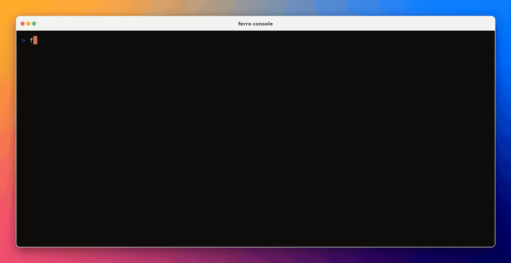

# Ferro Operator Console

**A scriptable CLI and interactive TUI for the [Ferro Labs AI Gateway](https://github.com/ferro-labs/ai-gateway).**
One static binary that is both a scriptable CLI and a full-screen terminal
console — health, request logs, API keys, and a live playground, without
opening a browser.



`ferro-cli` ships a single binary named **`ferro`**. Run it with a verb and it
behaves like any other Unix tool — `ferro status`, `ferro keys list`,
`ferro logs tail` — with clean stdout you can pipe into `jq`. Run it bare on a
terminal and it opens the console above.

Every console view has a scriptable twin. The console is a lens, never the only
door.

---

## Install

```bash
go install github.com/ferro-labs/gateway-cli/cmd/ferro@v0.1.0
```

Or download a release archive — `ferro_<version>_<os>_<arch>.tar.gz` (`.zip` on
Windows) — from the releases titled **Ferro CLI vX.Y.Z**, with `checksums.txt`
alongside. Linux, macOS, and Windows on amd64 and arm64. No runtime, no
dependencies: it is a single static binary.

Works with **AI Gateway v1.4.2 or later**.

> A withdrawn nested module also used v0.1.0 at
> `github.com/ferro-labs/ai-gateway/cli`. This standalone module has a distinct
> version namespace. Install only from `github.com/ferro-labs/gateway-cli`.

| Console release | Distribution | AI Gateway compatibility |
|---|---|---|
| v0.1.x | `github.com/ferro-labs/gateway-cli` | v1.4.2+ |

`ferro` is optional operator tooling for a running gateway. It is not part of
the gateway runtime and does not replace `ferrogw serve`, `ferrogw init`, or
offline `ferrogw validate`.

## Quickstart

```bash
export FERRO_URL=http://localhost:8080
export FERRO_API_KEY=fgw_...          # or let it fall back to MASTER_KEY

ferro status                          # health in one line
ferro                                 # the console (needs a terminal)
ferro status --format json | jq .     # stdout is always pure machine output
```

## Commands

Every list and get honours `--format json|yaml`.

| Command | What it does |
|---|---|
| `ferro` | Opens the console. On a pipe it refuses and points at `--help`. |
| `ferro status` | State, URL, latency, targets, providers, models, MCP, auth. |
| `ferro models` | Models the gateway routes — id, owner, mode, context window, capabilities. |
| `ferro providers` | Providers with status, circuit state, model count, and message. |
| `ferro mcp` | MCP tool servers — ready, required, last error. |
| `ferro plugins` | Configured plugins merged with the build's catalog, including fail-open. |
| `ferro services` | MCP, plugin, session, and audit availability in one report. |
| `ferro sessions` | Active operator sessions — subject, scopes, created, last seen, expires. |
| `ferro audit` | Audit trail. `--action --actor --outcome --since --limit`. |
| `ferro keys list` | Keys — name, masked secret, scopes, expiry, last used, uses, state. |
| `ferro keys get <id>` | One key, as structured output. |
| `ferro keys create` | `--name` (required), `--scope admin\|read_only`, `--expires-in`. |
| `ferro keys rotate <id>` | Mint a new secret; the previous one stops authenticating at once. |
| `ferro keys revoke <id>` | Immediate and irreversible. |
| `ferro logs list` | Request log — time, trace, provider, model, stage, duration, cost, tokens. |
| `ferro logs stats` | Totals, errors, tokens, cost, and latency percentiles over a window. |
| `ferro logs tail` | Follow the log. Poll-based, deduped, plain lines; Ctrl-C exits clean. |
| `ferro chat "<prompt>" --model <id>` | Streaming completion. Answer to stdout, usage to stderr. |
| `ferro version` | Version, commit, build date. Works with no gateway. |

**Persistent flags:** `--gateway-url`, `--profile`, `--format table|json|yaml`,
`--ascii` (use `[OK] [X] [!] [-]` instead of `✓ ✗ ! ·`), and
`--insecure-http` (explicitly allow plaintext HTTP to a non-loopback gateway).

## Configuration

| Variable | Effect |
|---|---|
| `FERRO_URL` | Gateway base URL. Default `http://localhost:8080`. |
| `FERRO_API_KEY` | Bearer credential sent to the gateway. |
| `MASTER_KEY` | Last-resort credential fallback. |
| `NO_COLOR` | Any value suppresses ANSI. (Also off under `TERM=dumb` or a non-TTY stdout.) |

```text
URL:  --gateway-url  >  FERRO_URL  >  profile.url  >  http://localhost:8080
key:  FERRO_API_KEY  >  profile.api_key_env deref  >  MASTER_KEY
```

**There is deliberately no credential flag.** Command-line arguments show up in
process listings and shell history, so credentials are environment-only.
Remote gateways require HTTPS by default because admin data and bearer
credentials must not cross a network in plaintext. Plain HTTP remains enabled
for loopback development; private-network HTTP requires `--insecure-http` on
each invocation.

### Profiles

`ferro-cli` stores **connection profiles only**, never gateway data, at
`os.UserConfigDir()/ferro/config.yaml` (`~/.config/ferro/config.yaml` on Linux).
A missing file is not an error.

```yaml
current_profile: prod
profiles:
  - name: prod
    url: https://gw.example.com
    api_key_env: PROD_KEY      # the NAME of an env var, never the secret
  - name: local
    url: http://localhost:8080
```

Select one with `--profile local`. A profile names the environment variable
holding its credential; the credential itself never touches the file.

## The console

`↵ run · tab complete · ↑ history · ctrl+r search · ? help · esc home · ctrl+c quit`

Four persistent regions: a header carrying identity and connection state, a left
rail answering *what is connected*, a main frame answering *what happened*, and a
command composer that is the only navigation surface — there is no tab row.

Type ordinary commands (`status`, `logs --since 15m --model claude-*`,
`keys create`) or slash aliases (`/logs`, `/keys`, `/playground`). `?` on an
empty composer prints the verb tree without destroying the transcript.

| Screen | Contents |
|---|---|
| **Home** | Bounded command transcript, rendered by the same formatting code the scriptable verbs use. |
| **Request logs** | Live tail with filters and a per-row detail pane that resolves a credential id to its key name. |
| **Keys** | Key table with derived state, a create wizard, and typed-confirmation rotate and revoke. |
| **Playground** | Streaming chat with `/model` and `/clear`, and a metadata line carrying route, latency, tokens, and cost. |

Layout adapts to width: ≥110 columns gets the mark, rail, and panels; 80–109
collapses the rail into a compact status frame; below 80 leaves output and the
composer. Nothing is ever clipped mid-border.

## Contracts worth relying on

These are tested behaviours, not aspirations.

- **stdout is the machine channel.** Narrative, warnings, and errors go to
  stderr, so `ferro <verb> --format json | jq` only ever sees JSON.
- **Exit codes are the API.** `ferro status` exits **1 only when the gateway is
  unreachable**. A reachable-but-degraded gateway exits **0** and prints its
  degraded state — so `ferro status || alert` pages on outages, not brownouts.
- **Secrets are shown exactly once.** `keys create` and `keys rotate` print the
  new secret once, on stdout, because the gateway stores only a hash. It never
  reaches the console transcript or the command history.
- **Missing is not zero.** An absent measurement renders `-`, never `0`. When
  `/readyz` reports no targets, you get `-`, because "none configured" and
  "yours are dead" are different answers and the gateway only sent one of them.
- **Redirects are refused, never followed.** A bearer token is never replayed to
  whatever host a redirect names; the target is surfaced as a hint instead.
- **A missing feature degrades one screen.** A 404 or 501 — no request-log
  store, sessions disabled — disables that panel with a note rather than
  ending the command or the app.
- **Colour never carries state alone.** Every status also has a glyph or text,
  so the full ladder holds: console → `NO_COLOR` → non-TTY plain text →
  `--format json`.
- **Nothing is cached on disk.** Everything re-derives from the API on each poll.

### Known gaps in v0.1.0

Stated plainly, because the console shows them rather than inventing values:

- The header reads `gateway —`: the gateway does not serve its own version over
  HTTP yet.
- The traffic panel renders `—` without a request-log store, since it derives
  from log statistics.
- Streaming responses carry no provider on the wire, so a chat's route is
  resolved afterwards by matching the response's request id against the request
  log — and is absent when no log store is configured. Usage still renders.
- The playground renders answers as word-wrapped plain text rather than
  formatted markdown. Streaming, batching, and the metadata line are unaffected.
- Not in this release: the config viewer, the capability matrix, the doctor
  checklist, and the init wizard. Their gateway endpoints exist; the screens
  do not.

## Development

This repository versions independently from AI Gateway. HTTP is the only
runtime boundary: this module imports no gateway package and does not depend on
the gateway module. Wire shapes are copied, never imported, and CI enforces the
boundary.

```bash
make fake     # fake gateway (cmd/fakegw) on 127.0.0.1:8080
make build    # go build -o ferro ./cmd/ferro
make test     # go test -race ./...
make lint     # golangci-lint run ./...
make itest    # contract suite against ../ai-gateway or FERRO_GATEWAY_SOURCE
```

`make fake` is the loop to use almost always. It serves the gateway's HTTP
contract from fixtures, so the whole CLI and console can be developed with **no
gateway, no provider credentials, and no network**:

```bash
make fake &
FERRO_URL=http://localhost:8080 FERRO_API_KEY=fgw_test go run ./cmd/ferro
```

`cmd/fakegw` takes `--addr`, `--degraded`, `--no-providers`, `--no-log-store`,
and `--no-auth` to reproduce failure states a healthy gateway will not show you
on demand. It is a development tool and is never in a release build.

`make itest` is the acceptance loop: it builds `ferrogw` from a separate AI
Gateway checkout, boots it, runs the contract suite, and tears it down. The fake
proves the CLI is internally correct; only this proves the contract is real.

## License

Apache 2.0 — see [`LICENSE`](LICENSE).
